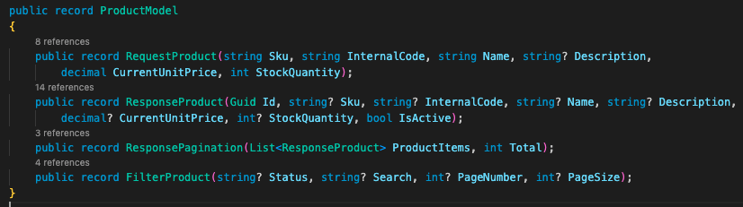
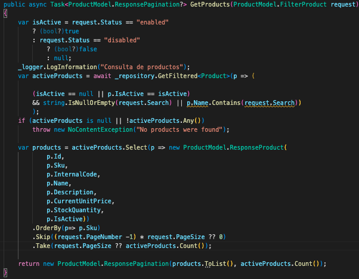
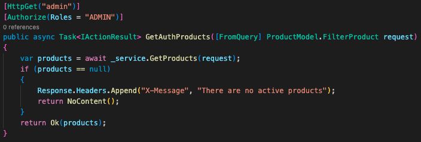

# Unidad 5

# Configuración
Se agrego un archivo .env.development
En este archivo tienes una variable de entorno llamada VITE_BACKEND_URL, debes cambiar su valor de acuerdo a la URL de tu backend.

# Paginación para productos, nuevo endpoint para listar productos para role ADMIN en BACKEND

## Las imagenes están basadas en una versión de un grupo que está cursando

Agregar FilterProduct y ResponsePagination


Agregar lógica en ProductsManagementService para soportar filtrado de status, busqueda por nombre y paginación


Crear un nuevo endpoint ("api/products/admin") en PouductController que será utilizado desde el panel del Dashboard


## Pasos de instalación

### Ejecutar:

```npm install```

### Ejecutar lint

```npm run lint```

### Iniciar aplicación

```npm run dev```

### Crear archivos para producción

```npm run build```
